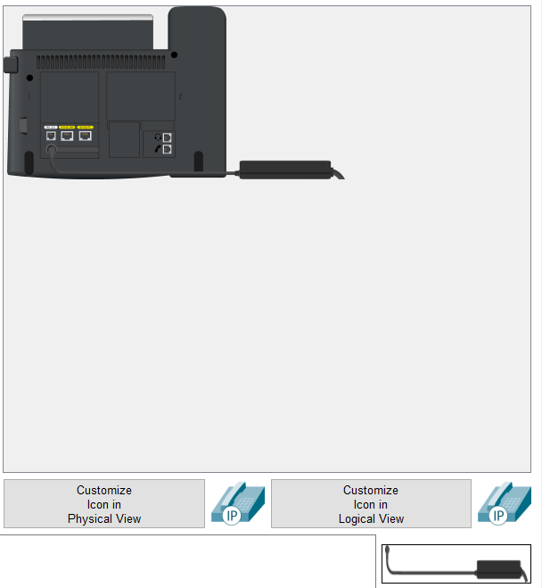

University: [ITMO University](https://itmo.ru/ru/)

Faculty: [FICT](https://fict.itmo.ru)

Course: [IP-telephony](https://github.com/itmo-ict-faculty/ip-telephony)

Year: 2022/2023

Group: K34212

Author: Rusinov Vitaliy Dmitrievich

Lab: Lab1

Date of create: 19.03.2023

Date of finished: 

---
# Цель работы:
Изучить рабочую среду Cisco Packet Tracer, ознакомиться с интерфейсами основных устройств, типами кабелей, научиться собирать топологию. Изучить построение сети IP-телефонии с помощью маршрутизатора, коммутатора и IP телефонов Cisco 7960 в среде Packet tracer  

## Часть 1
Добавим на рабочую область 4 коммутатора Switch-PT и 7 PC:

Соединим их в сеть кабелем Copper Straight through используя Ethernet порт:

Сеть приобретает вид:

Теперь присвоим каждому PC некоторый IP адресс и определим маску сети.
Каждому компьютеру был присвоен IP 192.168.1.{i + 1}, где i - порядковый номер компьютера. Маска - 255.255.255.0

Теперь выполним пинг одного из PC с произвольного хоста. Как видно из рисунка, сеть успешно настроена.

## Часть 2
Была собрана схема указанная на рисунке. Приступим к ее настройке. Сперва переопределим хостнейм роутера на CMERouter:

Далее настроим один из интерфейсов - fa0/0:

Теперь приступим к настройке конфига DHCP:
- зададим сеть, в которой будет работать DHCP
- укажим ip адресс нужного VLAN для передачи данных
- для передачи голоса
необходимо включить опцию 150. Эта опция нужна для того чтобы IPтелефоны использовали настройки CallManager Express с TFTP сервера

К IP телефонам необходимо подключить сеть питания:

DHCP был успешно настроен, телефоны получили свои IP динамически:

Теперь в роутере выполним следующую последовательность команд:
1) `CMERouter(config)#telephony-service` - включаем CallManager Express в конфигурационном режиме

2) `CMERouter(config-telephony)#max-dn 5` - задаем максимальное количество номеров, присваиваемых ip-телефонами

3) `CMERouter(config-telephony)#max-ephones 5` - Задаем максимальное количество ip-телефонов
4) `CMERouter(config-telephony)#ip source-address 192.168.10.1 port 2000` - определяем голосовой шлюз
5) `CMERouter(config-telephony)#auto assign 4 to 6` - автоматическое назначение внешних номеров

    `CMERouter(config-telephony)#auto assign 1 to 5`
6) `SwitchA(config)#interface range fa0/1 – 5` - настройка интерфейса управления коммутатором в определенном VLAN

    `SwitchA(config-if-range)#switchport mode access`

    `SwitchA(config-if-range)#switchport voice vlan 1`

Далее мы должны определить номера телефонов в сети:

Видно, что номера успешно присвоены:

Результат прозвона:

# Вывод:
В ходе выполнения работы была изучена рабочая среда Cisco Packet Tracer. Мы ознакомились с интерфейсами основных устройств, 
типами кабелей, научились собирать топологию. Мы изучили построение сети IP-телефонии с помощью маршрутизатора, коммутатора
и IP телефонов Cisco 7960 в среде Packet tracer.

