University: [ITMO University](https://itmo.ru/ru/)

Faculty: [FICT](https://fict.itmo.ru)

Course: [IP-telephony](https://github.com/itmo-ict-faculty/ip-telephony)

Year: 2022/2023

Group: K34212

Author: Rusinov Vitaliy Dmitrievich

Lab: Lab2

Date of create: 22.03.2023

Date of finished: 

---
# Цель работы
Изучить построение сети IP-телефонии с помощью маршрутизатора Cisco 2811, коммутатора Cisco catalyst 3560 и IP телефонов Cisco 7960.
## Часть 1
Соберем топологию согласно представленному рисунку, определим хостнейм роутера как CMERouter, отключим синтаксис ввода слов
от DNS серверов:

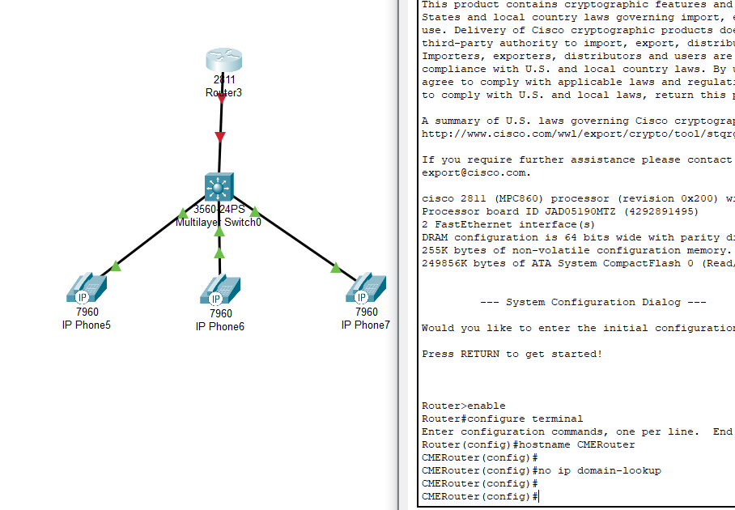

Зададим пароли для защиты маршрутизатора как в удаленном режиме, так и в режиме консоли:

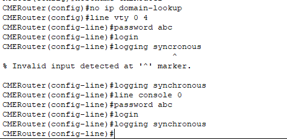

Настроим DHCP таким же образом, как в первой практической работе, сконфигурируем интерфейс fa0/0:

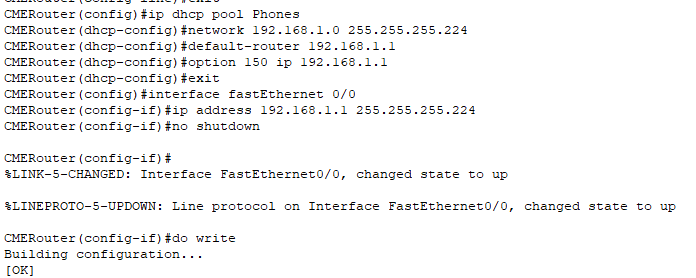

Мы настроили автоматическое назначение ip, подключим телефоны к питанию и подождем некоторое количество времени:

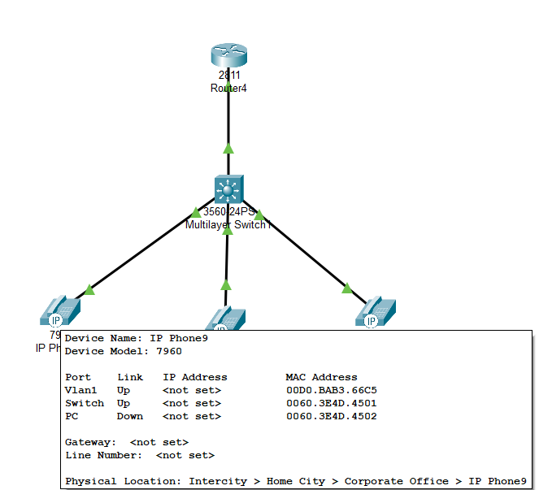

Как видно из рисунка, настройка защиты маршрутизатора прошла успешно, теперь для того, чтоьы пользоваться CLI необходимо ввести пароль:

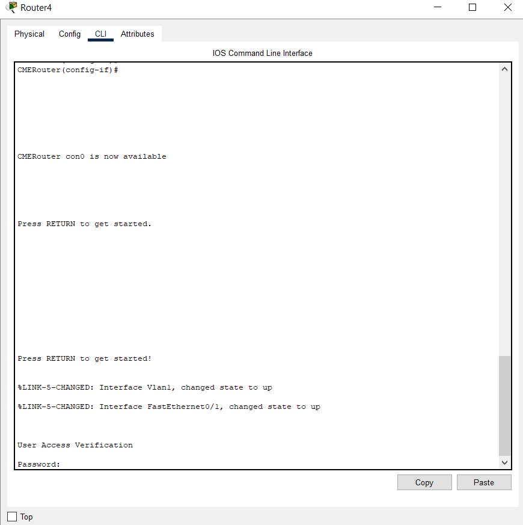

Настроим CallManager Express:

Теперь настроим интерфейс управления коммутатором в сети VLAN через назначение диапазона портов:

И каждому из ip-телефоном назначим номер:

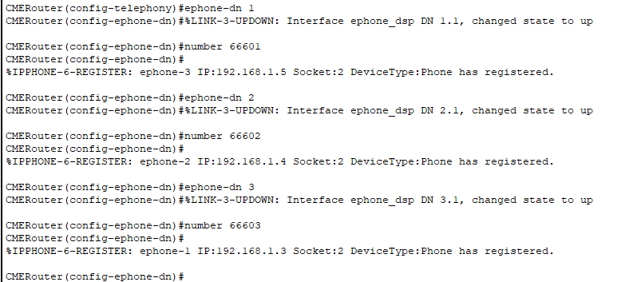

Результат прозвона:

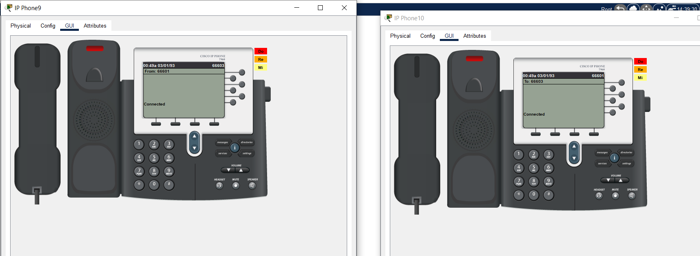
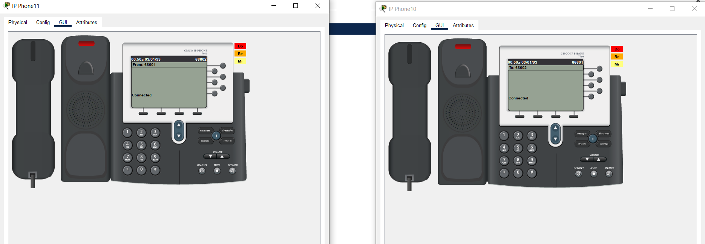

## Часть 2

Собранная согласно рисунку топология:

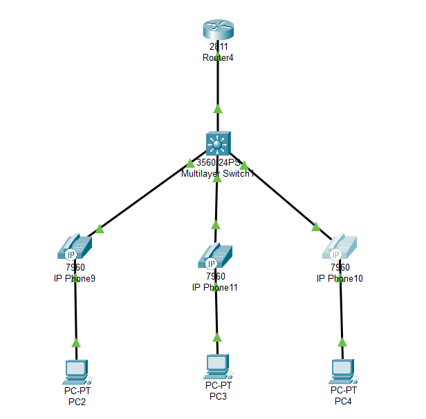

Создадим VLAN и присвоим им наименования:

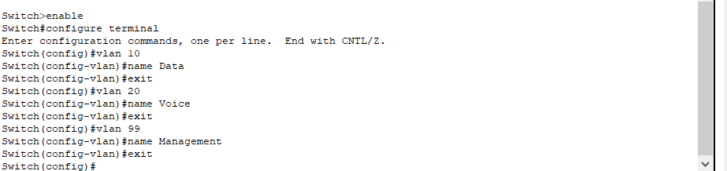

Настроим VLAN 99, зададим маршрут по умолчанию, а также настроим интерфейс управления коммутатором в сети VLAN через
назначение диапазона портов:

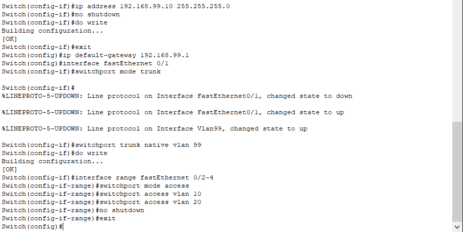

Далее настроим подинтерфейсы для VLAN 10 VLAN 20 И VLAN 99:

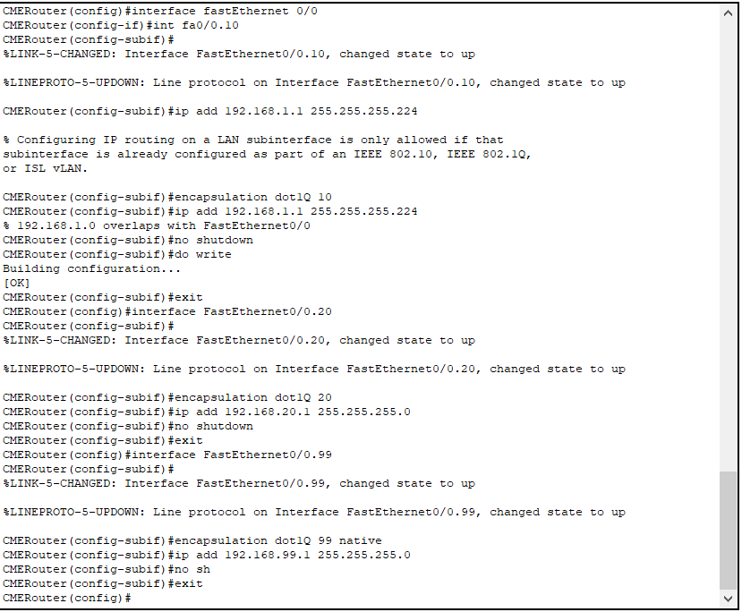

Настроим DHCP на роутере:

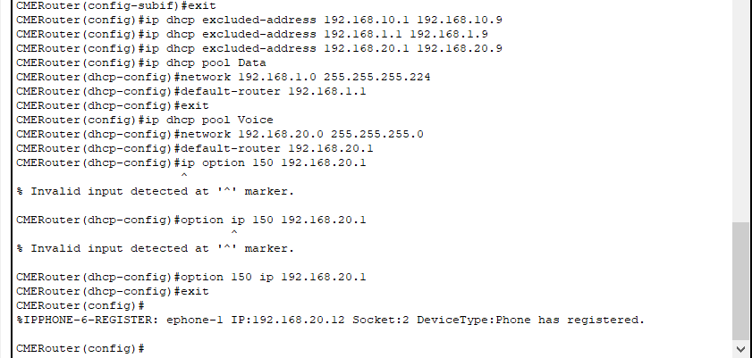

Исключим из пула адрес интерфейса маршрутизатора и DNS-сервера, настроим телефонию:

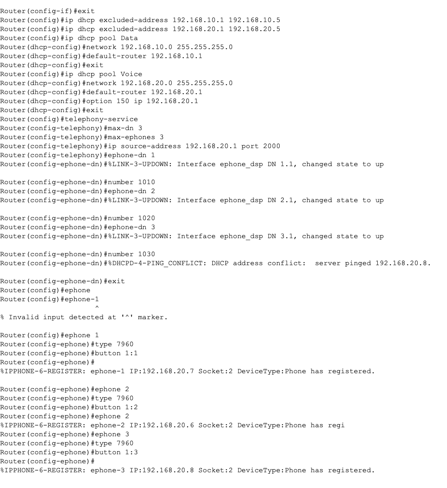

Результаты прозвонов:

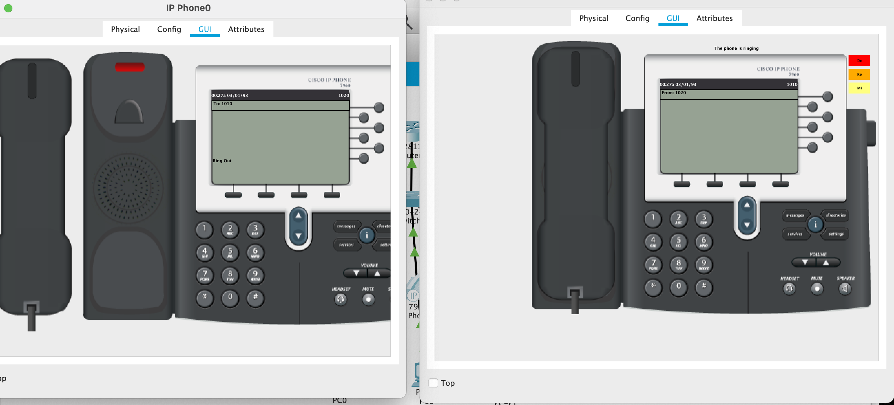
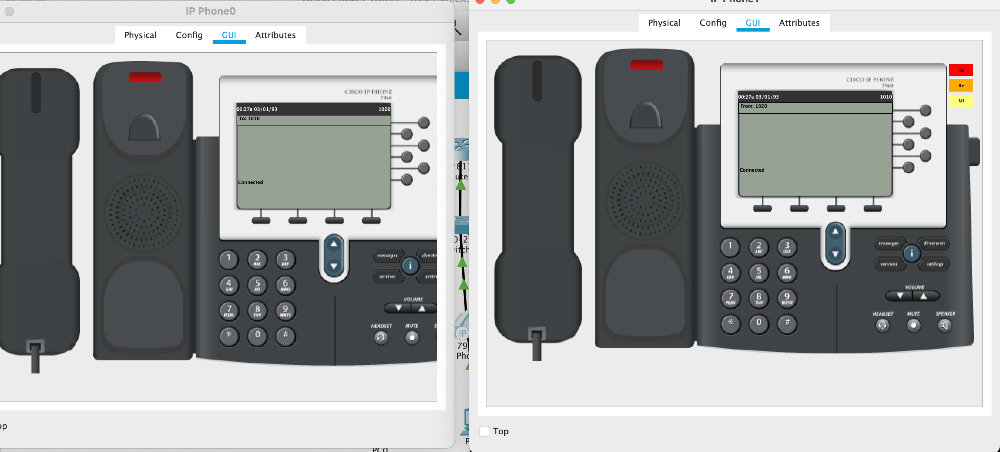

# Вывод
В ходе выполнения работы мы изучили построение сети IP-телефонии с помощью маршрутизатора Cisco 2811, коммутатора Cisco catalyst 3560 и IP телефонов Cisco 7960.
