University: [ITMO University](https://itmo.ru/ru/)

Faculty: [FICT](https://fict.itmo.ru)

Course: [IP-telephony](https://github.com/itmo-ict-faculty/ip-telephony)

Year: 2022/2023

Group: K34212

Author: Rusinov Vitaliy Dmitrievich

Lab: Lab4

Date of create: 22.03.2023

Date of finished: 

---
# Цель работы
Изучить построение сети IP-телефонии между удаленными филиалами с помощью маршрутизаторов Cisco 2811 и коммутаторов Cisco 2950Т. Изучить построение сети IP-телефонии между удаленными филиалами с помощью маршрутизаторов Cisco 2811 и Cisco 2600XM.
## Часть 1
Была построена топология, показанная на рисунке:

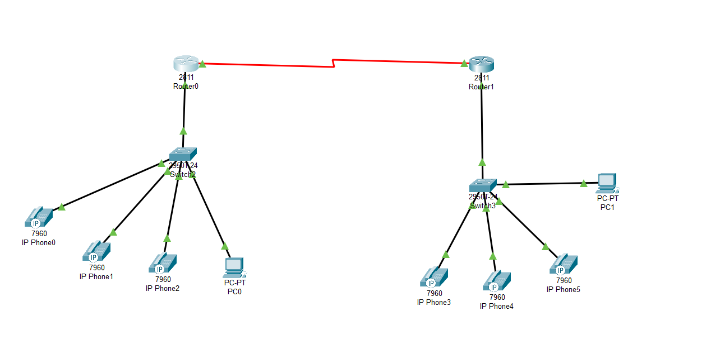
Настроим интерфейсы fa0/0 и s0/3/0, настроим dhcp:

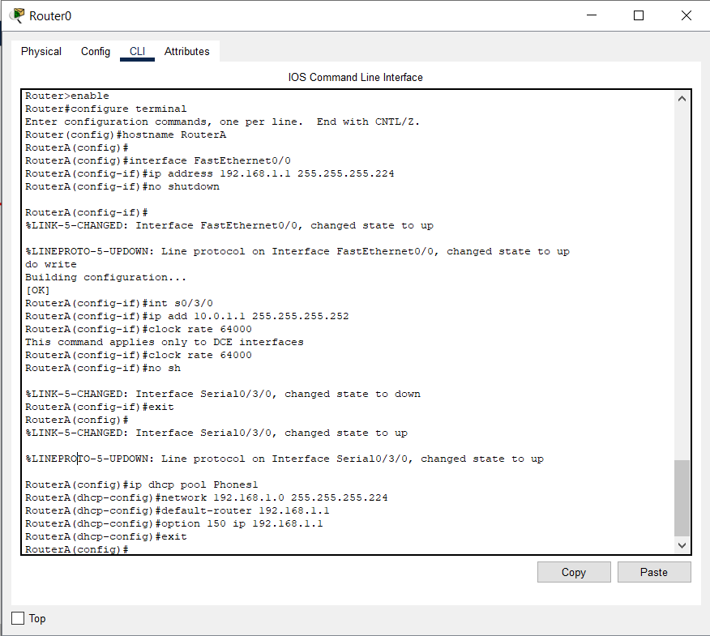
То же самое выполним на втором роутере:

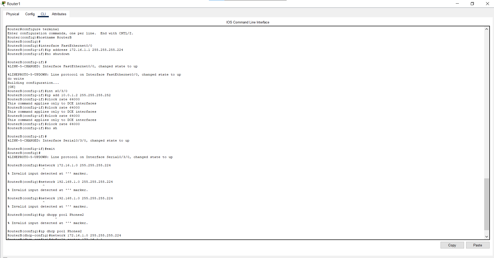
Теперь выполним настройку динамической маршрутизации на основе протокола RIP
второй версии для передачи информации между маршрутизаторами в сети:

    Router(config)#router rip

    Router(config-router)#version 2

    Router(config-router)#network 192.168.1.0

    Router(config-router)#network 10.0.1.0

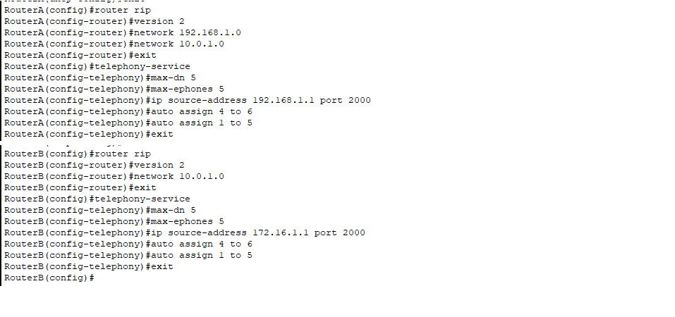
Назначение диапазона портов на коммутаторах:

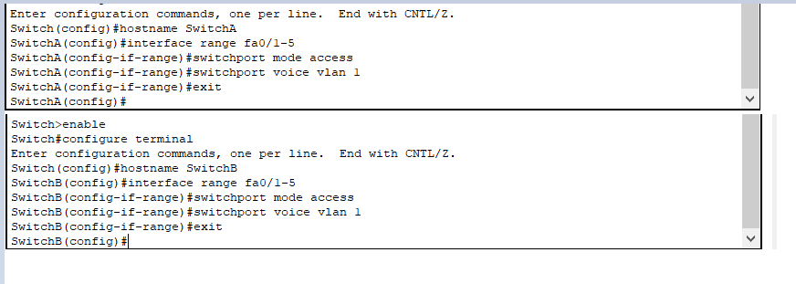
Настроим телефонию:

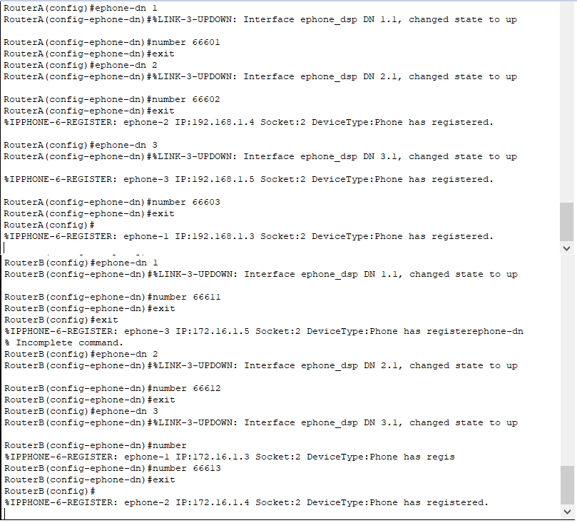
Настройка voip:

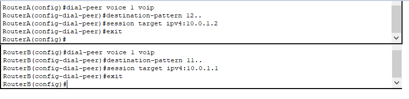
Результат пинга:

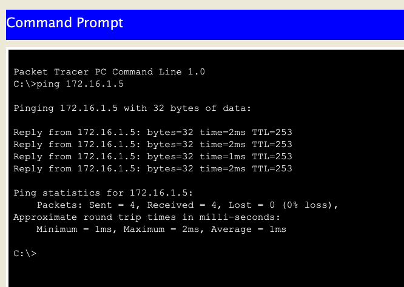
Результат провзона:

## Часть 2
Была построена топология, показанная на рисунке:

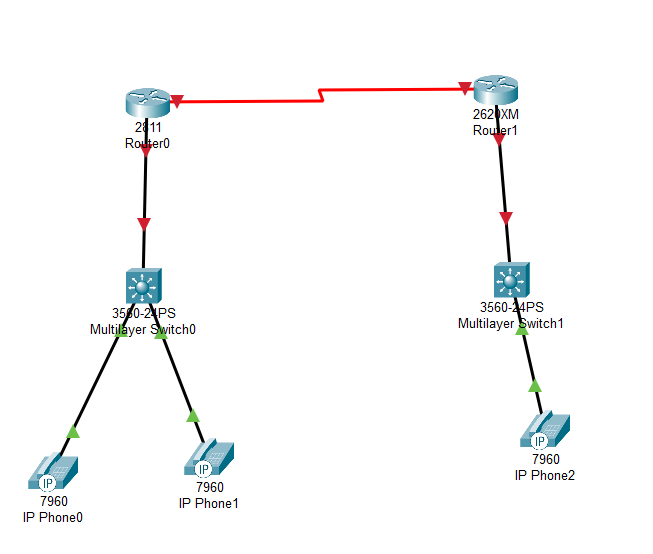
Для настройки маршрутизаторов были выполнены действия из 1-2 практической работы.

Настроим интерфейс s0/0, маршрутизацию поднимем на основе протокола eigrp:

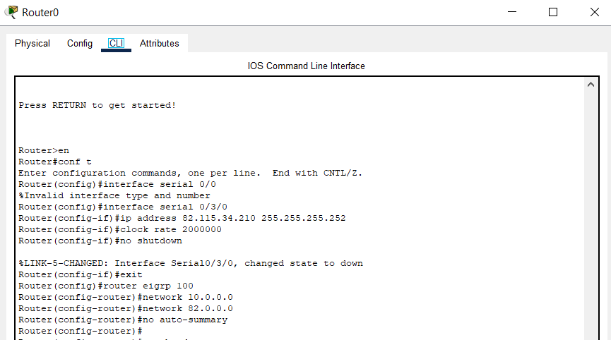
Настройка Cisco 2600, с результатами пинга первого маршрутизатора:

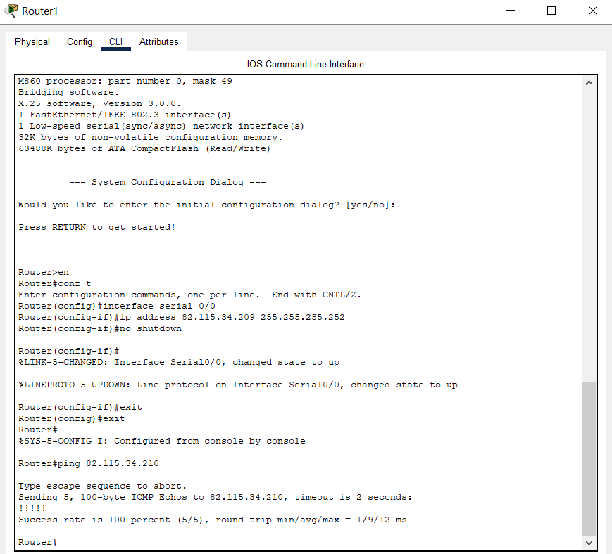
Зададим пароли для защиты коммутатора как в удаленном режиме, так и в режиме консоли. Порты перенесем в trunk режим:

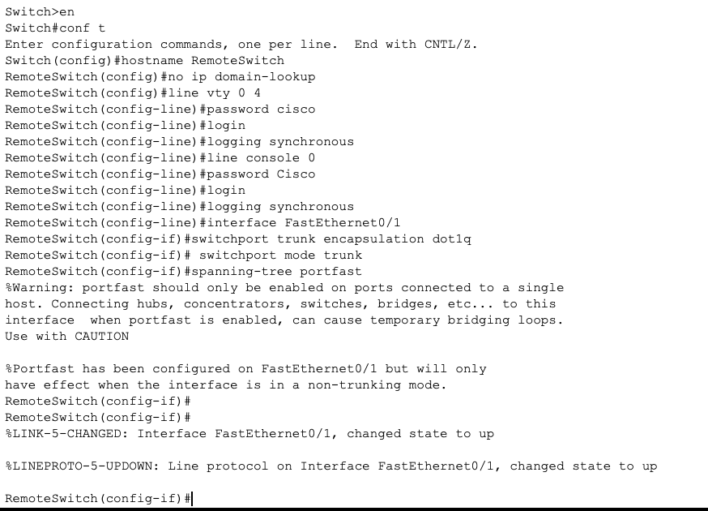
Результат прозвона:

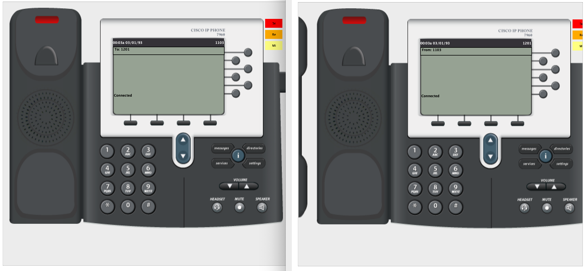
# Вывод
В ходе работы было изучено построение сети IP-телефонии между удаленными филиалами с помощью маршрутизаторов Cisco 2811 и коммутаторов Cisco 2950Т. Изучено построение сети IP-телефонии между удаленными филиалами с помощью маршрутизаторов Cisco 2811 и Cisco 2600XM.
